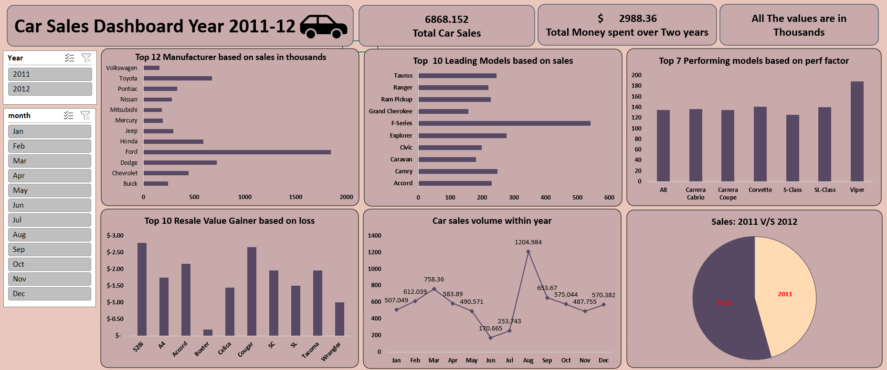

# 📊 Car Sales Dashboard (Excel Project)

> My first Excel-based interactive dashboard project analyzing car sales data for the years 2011–2012.

This project represents the beginning of my journey into **data analytics and dashboard development**.  
It is built entirely in **Microsoft Excel** and focuses on analyzing and visualizing car sales performance across multiple dimensions.

---

## 🚀 Project Overview

The **Car Sales Dashboard (2011–2012)** provides a complete visual summary of:

- Total car sales  
- Total money spent over two years  
- Top performing manufacturers  
- Leading car models  
- Performance-based ranking  
- Monthly sales trends  
- Resale value impact  
- Year-over-year comparison  

The dashboard transforms raw data into meaningful insights using interactive filters and visualizations.

---

## 📈 Key Insights Displayed

### 🔹 Overall Performance
- Total Car Sales: **6868.152 (in thousands)**
- Total Money Spent: **2988.36 (in thousands)**
- Comparison of sales between **2011 vs 2012**

### 🔹 Manufacturer Analysis
- Top 12 manufacturers based on total sales
- Clear identification of leading brands

### 🔹 Model Performance
- Top 10 best-selling models
- Top 7 performing models based on performance factor

### 🔹 Resale Value Analysis
- Top resale value gainers based on loss metrics

### 🔹 Monthly Sales Trend
- Month-wise car sales visualization
- Identification of peak and low sales months

---

## 🛠 Tools & Features Used

- **Microsoft Excel**
- Pivot Tables
- Pivot Charts
- Slicers (Year & Month filters)
- Bar Charts
- Line Charts
- Pie Chart
- Dashboard formatting & layout design

---

## 🎯 Interactive Features

- Year filter (2011 / 2012)
- Month-wise filtering
- Dynamic chart updates
- Clean layout with performance indicators

The dashboard updates automatically based on selected filters.

---

## 🧠 What I Learned From This Project

As my first dashboard project, this helped me understand:

- How to structure raw data for analysis  
- Creating meaningful KPIs  
- Designing interactive dashboards  
- Storytelling with data  
- Visual hierarchy and layout planning  
- Using Excel beyond basic spreadsheets  

This project laid the foundation for my journey into **Data Analytics and Business Intelligence**.

---

## 📊 Business Value

This dashboard helps stakeholders:

- Identify top-performing manufacturers  
- Understand model demand trends  
- Analyze sales fluctuations  
- Compare yearly growth  
- Make data-driven decisions  

---

## 📌 Project Scope

- Academic / Practice project  
- Built for learning and skill development  
- Focused on dashboard design and data visualization  

---

## 🔮 Future Improvements

- Add more years of data  
- Include profit margin analysis  
- Add region-wise breakdown  
- Convert to Power BI for advanced interactivity  
- Add forecasting features  

---

## 📷 Dashboard Preview

---

## 📌 Final Note

This was my **first step into data analytics dashboards**, and it marks the beginning of building real-world analytical thinking.

Every advanced dashboard starts with a first one — this is mine 🚀

If you find it helpful or inspiring, feel free to ⭐ the repository.
